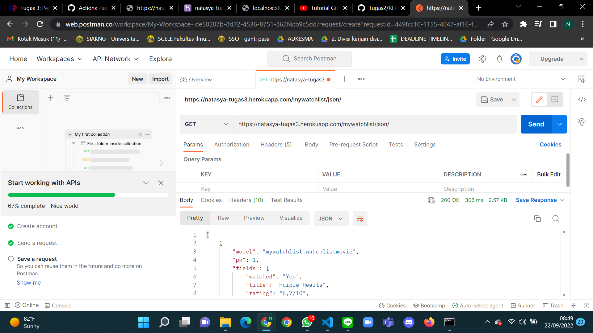
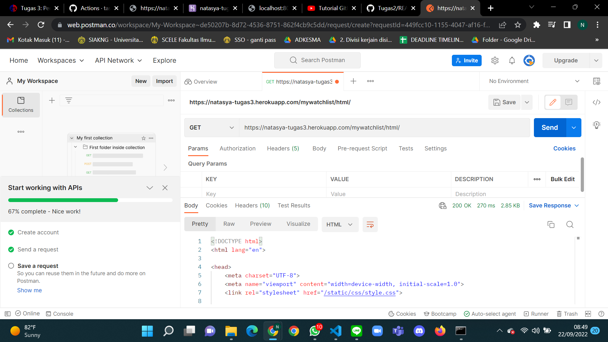

Link Heroku html : https://natasya-tugas3.herokuapp.com/mywatchlist/html/
Link Heroku xml : https://natasya-tugas3.herokuapp.com/mywatchlist/xml/
Link Heroku json : https://natasya-tugas3.herokuapp.com/mywatchlist/json/

## Jelaskan perbedaan antara JSON, XML, dan HTML!
- JSON (JavaScript Object Notation) merupakan file yang berekstensi .json digunakan untuk format data yang menggunakan objek JavaScript. Dalam elemennya json tidak rapi untuk dilihat dibandingkan xml.
- XML (Extensible Markup Language) merupakan file yang berekstensi .xml yang digunakan untuk menyederhanakan pertukaran dan penyimpanan data. Sehingga elemen pada xml lebih terstruktur, mudah dibaca oleh manusia dan mesin.
- HTML (Hypertext Markup Language) merupakan file yang berekstensi .html yang digunakan untuk membuat halaman website. Berbeda dengan json dan xml, html menampilkan isi client/user yang dapat langsung diterima oleh user.

## Jelaskan mengapa kita memerlukan data delivery dalam pengimplementasian sebuah platform?
Karena dengan adanya data delivery dalam pengimplementasian sebuah platform akan memudahkan dalam pengiriman data. Selain itu data-data yang disimpan ataupun diolah akan diterima dengan baik oleh user yang biasanya menggunakan json, xml, dan html.

## Jelaskan bagaimana cara kamu mengimplementasikan checklist di atas.
1. Membuat aplikasi dengan perintah manage.py startapp mywatchlist pada folder tugas2_natasyaashil. Lalu menambahkan path pada urls.py django project dan menambahkan juga pada installed_apps.
2. Membuat model mywatchlist pada models.py dengan watched, title, rating, release_date, dan review. 
3. Membuat fungsi di views.py mywatchlist untuk menyajikan xml, json, dan html.
4. Melakukan routing dengan local host.
5. Melakukan deploy ke Heroku.

## POSTMAN

